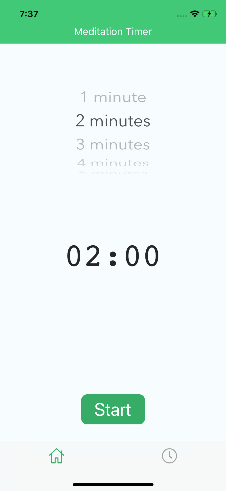

# MeditationAppIOS
Meditation App with support for HealthKit

A demonstration of the use of HealthKit. It´s also my first time creating the GUI from code only, without using the Storyboard.

Meditation view with a simple countdown timer
<table><tr><td>
 
</td></tr></table>

List of previous meditation sessions retrieved from HealthKit
<table><tr><td>
 
</td></tr></table>
